  

  

    
    
    
    
    
  

  

    <a href="#-player-profile">Player profile</a> ·
    <a href="#-featured-builds">Featured builds</a> ·
    <a href="#-telemetry">Telemetry</a> ·
    <a href="#-side-quests">Side quests</a> ·
    <a href="#-open-channel">Contact</a>
  

## 🎮 Player profile

| | |
| :--- | :--- |
| ▸ **NOW** | **[Orbitrage](https://orbitrage.ai)** — Co-Founder & CTO · LLM routing, observability & evaluation · Localhost HQ Founders Program |
| ▸ **PREV** | **[Timeln](https://timeln.app)** — first engineering hire · Memgraph → FalkorDB migration · **[Procurv](https://www.procurvhq.com)** — co-founder |
| ▸ **FOCUS** | vLLM/SGLang serving · model routing · KV caching · batching · agent backends · deployment |
| ▸ **BASE** | Bengaluru, India · IIIT Ranchi, ECE — Class of 2027 |

## 🚀 Featured builds

<table>
<tr>
<td width="50%" valign="top">

<h3>🪐 <a href="https://orbitrage.ai">Orbitrage</a></h3>

Routing, observability &amp; evaluation for production LLM apps. I build the gateway, backend, and deploys.

<strong>500+ users · 5B+ tokens/mo</strong>

<code>Routing</code> <code>Evals</code> <code>Azure</code>

<a href="https://orbitrage.ai"><strong>Product ↗</strong></a> · <a href="https://docs.orbitrage.ai">Docs</a>

</td>
<td width="50%" valign="top">

<h3>⚙️ <a href="https://github.com/AbhyudayPatel/Inference_from_scratch">Inference From Scratch</a></h3>

GPT-2 in NumPy, end to end: BPE → attention → KV cache → batching → FastAPI serving.

A hands-on lab for how serving engines work.

<code>NumPy</code> <code>KV cache</code> <code>FastAPI</code>

<a href="https://github.com/AbhyudayPatel/Inference_from_scratch"><strong>GitHub ↗</strong></a> · <a href="https://github.com/AbhyudayPatel/Inference_from_scratch/tree/master/Day05_Serving_An_Engine">Serving code</a>

</td>
</tr>
<tr>
<td width="50%" valign="top">

<h3>🎙️ <a href="https://github.com/AbhyudayPatel/DuoTalk">DuoTalk</a></h3>

PyPI framework for <strong>1–10 voice agents</strong> — debates, panels, interviews, personas, turn-taking.

<code>LiveKit</code> <code>Gemini</code> <code>MIT</code>

<a href="https://github.com/AbhyudayPatel/DuoTalk"><strong>GitHub ↗</strong></a> · <a href="https://youtu.be/KxT4Xm6kKZ8"><strong>▶ Demo</strong></a> · <a href="https://pypi.org/project/duotalk/">PyPI</a>

</td>
<td width="50%" valign="top">

<h3>📦 <a href="https://github.com/AbhyudayPatel/Procurv">Procurv</a></h3>

<strong>10 agent tools</strong> for procurement — RFPs, outreach, reverse auctions, reports. OAuth + billing + deploys.

Wound down, fully open-sourced.

<a href="https://github.com/AbhyudayPatel/Procurv"><strong>GitHub ↗</strong></a> · <a href="https://youtu.be/jzp-LK5PZCg"><strong>▶ Demo</strong></a> · <a href="https://www.procurvhq.com">Site</a>

</td>
</tr>
</table>

## 📊 Telemetry

<!-- assets/github-metrics.svg is generated daily by the Action in .github/workflows/metrics.yml — enable + run it once before publishing (see SETUP.md). -->

  

  

## 📈 Stat sheet

## 🧪 Side quests

| Build | One-liner | Links |
| :--- | :--- | :--- |
| 🧭 **[HELIX](https://github.com/AbhyudayPatel/helix-agent-arena)** | Self-healing agent trajectories — **45/57** on AppWorld dev | [Code](https://github.com/AbhyudayPatel/helix-agent-arena) · [Results](https://github.com/AbhyudayPatel/helix-agent-arena/blob/main/RESULTS.md) |
| 🧱 **[Portable Compute](https://github.com/AbhyudayPatel/portable-compute-environments)** | Sandbox API + tenant-aware scheduler lab | [Code](https://github.com/AbhyudayPatel/portable-compute-environments) · [Scheduler](https://github.com/AbhyudayPatel/portable-compute-environments/tree/master/sandbox-scheduler) |
| 📸 **[Webshot](https://github.com/AbhyudayPatel/Webshot)** | Go screenshot service — worker pools, queues, caching | [Code](https://github.com/AbhyudayPatel/Webshot) |
| ⌨️ **[Autocomplete](https://github.com/AbhyudayPatel/Autocomplete)** | Local-model completion engine with plugins & streaming | [Code](https://github.com/AbhyudayPatel/Autocomplete) |
| 🛡️ **[Doc Validator](https://github.com/AbhyudayPatel/Document_validator)** | Gemini extraction + deterministic validation, FastAPI | [Code](https://github.com/AbhyudayPatel/Document_validator) |

<strong>🗃️ Archive — earlier builds, tools & forks</strong>

 

| Repository | What it is |
| :--- | :--- |
| [Grocery Voice Agent](https://github.com/AbhyudayPatel/Grocery_Voice_Agent) | LiveKit voice tools wired to cart APIs |
| [Memgraph Exports](https://github.com/AbhyudayPatel/memgraph_exports) | Cypher/JSON backup & restore tooling |
| [Memgraph Image](https://github.com/AbhyudayPatel/memgraph_image) | Deployment-ready Memgraph Docker config |
| [Procurv GPT](https://github.com/AbhyudayPatel/Procurv_GPT) | Python/FastAPI procurement backend |
| [Procurv Frontend](https://github.com/AbhyudayPatel/procurv_frontend) | Early Procurv product frontend |
| [Inferencing Notes](https://github.com/AbhyudayPatel/Inferencing_notes) | Inference notes + attributed CUDA course work |
| [TBF Vortex](https://github.com/AbhyudayPatel/TBF_Vortex) | Vibration-based fan fault classification |
| [Crypto Analyser](https://github.com/AbhyudayPatel/cryptocurrency_correlation_analyser) | Streamlit market-data explorer |
| [ProjectNest](https://github.com/AbhyudayPatel/ProjectNest) | Early project-discovery prototype |
| [Discord Bot](https://github.com/AbhyudayPatel/Chatgpt-Discord-Bot) | Early OpenAI × Discord integration |
| [Cybersecurity](https://github.com/AbhyudayPatel/Cybersecurity) | Password & hashing exercises |
| [Early Site](https://github.com/AbhyudayPatel/AbhyudayPatel.github.io) | First personal website |

**Forks & references** (not original builds):
[LiveKit Agents](https://github.com/AbhyudayPatel/agents) ·
[Build Your Own X](https://github.com/AbhyudayPatel/build-your-own-x) ·
[Agentic News](https://github.com/AbhyudayPatel/Agentic_News) ·
[Food Distribution](https://github.com/AbhyudayPatel/Food-distribution-Service)

## 🎒 Loadout

 

**+ the AI stack:** vLLM · SGLang · LangGraph · LangChain · LlamaIndex · MCP · LiveKit · Pipecat · Deepgram · Cartesia · FalkorDB · Memgraph · Redis · MongoDB

## 📡 Open channel

Working on **LLM inference, model serving, AI backends, or systems that need to survive production**? Let's compare notes.

**[Email](mailto:ai.abhyuday@gmail.com)** · **[LinkedIn](https://www.linkedin.com/in/abhyudaypatel/)** · [All repositories](https://github.com/AbhyudayPatel?tab=repositories)

---

  Build something useful. Understand how it works. Make it run reliably. 
  <a href="https://github.com/AbhyudayPatel/AbhyudayPatel">Profile source</a>

