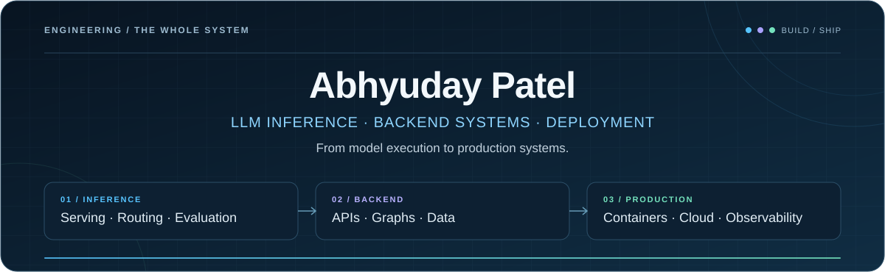

  

  
<strong>LLM Inference · AI Backends · Production Deployment</strong>

  

    
    
    
    
  

  

    <a href="#start-here">Featured work</a> ·
    <a href="#under-the-hood">Systems & experiments</a> ·
    <a href="#engineering-toolkit">Toolkit</a> ·
    <a href="#lets-talk-systems">Get in touch</a>
  

Hey, I'm Abhyuday 👋 I work on **LLM inference, AI backends, and production deployment**—from vLLM/SGLang serving and model routing to the APIs, data systems, and infrastructure around them.

The questions I keep coming back to: **Where is the latency? What is using the memory? Which model does the job? What happens when a provider fails?**

## Start here

**Models, serving systems, and the products built on top.**

<table>
<tr>
<td width="50%" valign="top">

<h3>🪐 <a href="https://orbitrage.ai">Orbitrage</a></h3>

<strong>Co-Founder & CTO · Routing, observability & evaluation</strong>

A gateway and control layer for production LLM applications: model routing, provider fallbacks, session telemetry, and evaluation. I work on its backend and deployment.

<!-- Update usage figures when publishing; these are platform-level totals. -->

<strong>500+ users · 5 billion+ tokens/month</strong>

Orbitrage participated in the <strong>Localhost HQ Founders Program</strong>.

<code>Model routing</code> <code>Evaluation</code> <code>Azure</code>

<a href="https://orbitrage.ai"><strong>Product ↗</strong></a> · <a href="https://docs.orbitrage.ai">Documentation</a>

</td>
<td width="50%" valign="top">

<h3>⚙️ <a href="https://github.com/AbhyudayPatel/Inference_from_scratch">Inference From Scratch</a></h3>

<strong>Understand the serving engine by building one.</strong>

GPT-2 inference in NumPy: raw weight loading, byte-level BPE, attention, KV caching, batching experiments, and a FastAPI serving layer.

A hands-on implementation lab for inference and serving.

<code>NumPy</code> <code>KV cache</code> <code>FastAPI</code>

<a href="https://github.com/AbhyudayPatel/Inference_from_scratch"><strong>GitHub ↗</strong></a> · <a href="https://github.com/AbhyudayPatel/Inference_from_scratch/tree/master/Day05_Serving_An_Engine">Serving implementation</a>

</td>
</tr>
<tr>
<td width="50%" valign="top">

<h3>🎙️ <a href="https://github.com/AbhyudayPatel/DuoTalk">DuoTalk</a></h3>

<strong>More than one voice in the conversation.</strong>

A published Python framework for <strong>1–10 voice agents</strong>: debates, panels, interviews, roundtables, and chat, with configurable personas and speaker coordination.

<code>Python</code> <code>LiveKit</code> <code>Gemini</code>

<a href="https://github.com/AbhyudayPatel/DuoTalk"><strong>GitHub ↗</strong></a> · <a href="https://youtu.be/KxT4Xm6kKZ8"><strong>▶ YouTube demo</strong></a> · <a href="https://pypi.org/project/duotalk/">PyPI</a>

</td>
<td width="50%" valign="top">

<h3>📦 <a href="https://github.com/AbhyudayPatel/Procurv">Procurv</a></h3>

<strong>Co-Founder · AI-native procurement</strong>

<strong>10 structured agent tools</strong> for RFPs, supplier outreach, vendor management, reverse auctions, and reporting—plus OAuth, billing, and deployment.

We wound down the company and open-sourced the platform.

<code>LangGraph</code> <code>Next.js</code> <code>Supabase</code>

<a href="https://github.com/AbhyudayPatel/Procurv"><strong>GitHub ↗</strong></a> · <a href="https://youtu.be/jzp-LK5PZCg"><strong>▶ YouTube demo</strong></a> · <a href="https://www.procurvhq.com">Product site</a>

</td>
</tr>
</table>

## Under the hood

**The smaller systems explain how I think about the bigger ones.**

| Project | What to look at | Explore |
| :--- | :--- | :--- |
| **[HELIX](https://github.com/AbhyudayPatel/helix-agent-arena)** | Trajectory-aware agents with failure detection, memory-assisted repair, and completion verification. **45/57 tasks completed** in recorded AppWorld development evaluations. | [Code](https://github.com/AbhyudayPatel/helix-agent-arena) · [Results](https://github.com/AbhyudayPatel/helix-agent-arena/blob/main/RESULTS.md) |
| **[Portable Compute Environments](https://github.com/AbhyudayPatel/portable-compute-environments)** | A local sandbox API and scheduling lab: tenant-aware admission, priority aging, idempotent jobs, and browser workspaces. Includes security limitations. | [Code](https://github.com/AbhyudayPatel/portable-compute-environments) · [Scheduler](https://github.com/AbhyudayPatel/portable-compute-environments/tree/master/sandbox-scheduler) |
| **[Webshot](https://github.com/AbhyudayPatel/Webshot)** | A Go screenshot service with Chrome worker pooling, request queues, caching, resource cleanup, and health reporting. | [Code & deployment](https://github.com/AbhyudayPatel/Webshot) |
| **[Autocomplete](https://github.com/AbhyudayPatel/Autocomplete)** | A local-model completion engine with plugins, streaming, caching, and repository context. | [Code](https://github.com/AbhyudayPatel/Autocomplete) |
| **[Document Validator](https://github.com/AbhyudayPatel/Document_validator)** | Gemini extraction, Pydantic schemas, and deterministic insurance-document validation behind a FastAPI service. | [Code](https://github.com/AbhyudayPatel/Document_validator) |

<strong>🗂️ More from the workshop — earlier projects, supporting tools, and learning</strong>

 

| Repository | What you'll find |
| :--- | :--- |
| [Grocery Voice Agent](https://github.com/AbhyudayPatel/Grocery_Voice_Agent) | LiveKit voice tools connected to cart-management APIs. |
| [Memgraph Exports](https://github.com/AbhyudayPatel/memgraph_exports) | Cypher/JSON backup, restore, and graph-management tooling. |
| [Memgraph Image](https://github.com/AbhyudayPatel/memgraph_image) | A deployment-oriented Memgraph Docker image configuration. |
| [Procurv GPT](https://github.com/AbhyudayPatel/Procurv_GPT) | The Python/FastAPI procurement implementation and auction workflows. |
| [Procurv Frontend](https://github.com/AbhyudayPatel/procurv_frontend) | An earlier Procurv product frontend. |
| [Inferencing Notes](https://github.com/AbhyudayPatel/Inferencing_notes) | Inference notes, experiments, and attributed CUDA learning material. |
| [TBF Vortex](https://github.com/AbhyudayPatel/TBF_Vortex) | Vibration-based fan-status classification with neural networks. |
| [Crypto Correlation Analyser](https://github.com/AbhyudayPatel/cryptocurrency_correlation_analyser) | A Streamlit market-data exploration tool. |
| [ProjectNest](https://github.com/AbhyudayPatel/ProjectNest) | An early student-project discovery and sharing prototype. |
| [ChatGPT Discord Bot](https://github.com/AbhyudayPatel/Chatgpt-Discord-Bot) | An early Discord/OpenAI integration. |
| [Cybersecurity](https://github.com/AbhyudayPatel/Cybersecurity) | Early password-generation and hashing exercises. |
| [Early Personal Site](https://github.com/AbhyudayPatel/AbhyudayPatel.github.io) | An early personal website. |

**Forks & references** — listed separately from projects I built:
[LiveKit Agents](https://github.com/AbhyudayPatel/agents) ·
[Build Your Own X](https://github.com/AbhyudayPatel/build-your-own-x) ·
[Agentic News](https://github.com/AbhyudayPatel/Agentic_News) ·
[Food Distribution Service](https://github.com/AbhyudayPatel/Food-distribution-Service)

## Beyond the repositories

- **[Timeln](https://timeln.app) · First engineering hire at Genius AI Solutions.** Built the backend and knowledge-graph system for an AI second brain, owned deployment end to end, and migrated Memgraph to user-level FalkorDB clusters.
- **Independent consulting.** Deployed LLM inference pipelines with vLLM/SGLang, real-time voice agents, and graph-backed APIs for global clients; owned backend architecture and production deployment.
- **Bengaluru, India.** Studying Electronics & Communication Engineering at **IIIT Ranchi — Class of 2027**.

## Engineering toolkit

| Layer | Tools I work with |
| :--- | :--- |
| **Inference & serving** | vLLM · SGLang · PyTorch · Hugging Face · KV caching · Continuous batching |
| **AI applications** | LangGraph · LangChain · LlamaIndex · MCP · RAG · Model evaluation |
| **Backend & data** | Python · TypeScript · Go · FastAPI · PostgreSQL · Redis · FalkorDB · Memgraph |
| **Voice & streaming** | LiveKit · Pipecat · WebRTC · Deepgram · Cartesia · WebSockets · SSE |
| **Deployment & operations** | Docker · Kubernetes · Azure Container Apps · AWS · GCP · Linux · GitHub Actions |

### How I approach the work

- **Make failure paths explicit.** Retries, fallbacks, isolation, and recovery belong in the design.
- **Measure the trade-offs.** Time to first token, token throughput, memory use, cost, and output quality belong in the same conversation.
- **Own the deployment.** Authentication, migrations, observability, and releases are part of the product.
- **Build below the abstraction.** Small implementations make large frameworks easier to reason about.

## Let's talk systems

Working on **LLM inference, model serving, AI backends, real-time voice, or a difficult deployment problem**? I'd enjoy comparing notes.

**[Email me](mailto:ai.abhyuday@gmail.com)** · **[Connect on LinkedIn](https://www.linkedin.com/in/abhyudaypatel/)** · [Browse all repositories](https://github.com/AbhyudayPatel?tab=repositories)

---

  Build something useful. Understand how it works. Make it run reliably. 
  <a href="https://github.com/AbhyudayPatel/AbhyudayPatel">Profile source</a>

